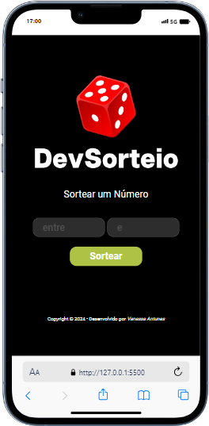

<h2>Projeto2-Random-Soteador-DevClub</h2>
 
 <h3>✔️Sobre</h3>

    O projeto Sorteador permite realizar um sorteio rápido entre dois números, apresentando um resultado instantâneo,
    para realizar o sorteio, devem ser digitados dois números em seus respectivos campos.

<h3>✔️Tecnologias</h3>

Este projeto foi desenvolvido com:

Foto do projeto:
  

